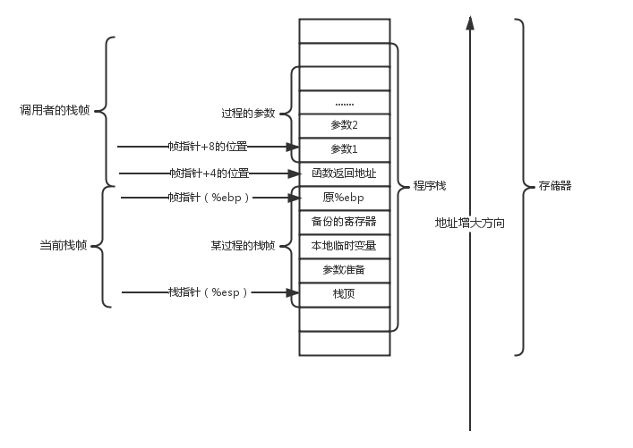

##  控制
#### 条件码
最常用的条件码
- CF：进位标志。最近的操作使最高位产生了进位。可用来检查无符号操作额溢出。
- ZF：零标志。最近的操作得出的结果为0
- SF：符号标志。最近的操作得到的结果为负数
- OF：溢出标志。最近的操作导致一个补码溢出———正溢出或副溢出
#### 访问条件码
条件码通常不会直接读取，常用的使用方法有三种：
1. 可以根据条件码的某种组合将一个字节设置为0或者1
2. 可以条件跳转到程序的某个其他部分
3. 可以有条件的传送数据

#### 跳转指令
[汇编跳转指令总结](https://blog.csdn.net/liujiayu2/article/details/50737518)

#### 循环
C语言提供了多种循环结构，即do-while、while、和for。汇编中没有相应的指令存在，可以用条件测试和跳转组合起来实现循环的效果。

do-while循环
```
loop:
    body-statement
    t = test-expr;
    if (t):
        goto loop;
```

while循环
```
    goto test;
loop:
    body-statement
test:
    t = test-expr;
    if (t)
        goto loop;
```

## 过程
程序栈由一系列栈帧构成，这些栈帧每一个都对应一个过程，而且每一个帧指针+4的位置都存储着函数的返回地址，每一个帧指针指向的存储器位置当中都备份着调用者的帧指针。每一个栈帧都建立在调用者的下方（也就是地址递减的方向），当被调用者执行完毕时，这一段栈帧会被释放。%ebp和%esp的值指示着栈帧的两端，而栈指针会在运行时移动，所以大部分时候，在访问存储器的时候会基于帧指针访问，因为在一直移动的栈指针无法根据偏移量准确的定位一个存储器位置。

由于栈帧是向地址递减的方向延伸，因此如果我们将栈指针减去一定的值，就相当于给栈帧分配了一定空间的内存。因为在栈指针向下移动以后（也就是变小了），帧指针和栈指针中间的区域会变长，这就是给栈帧分配了更多的内存。相反，如果将栈指针加上一定的值，也就是向上移动，那么就相当于压缩了栈帧的长度，也就是说内存被释放了。需要注意的是，上面的一切内容，都基于一个前提，那就是帧指针在过程调用当中是不会移动的。



