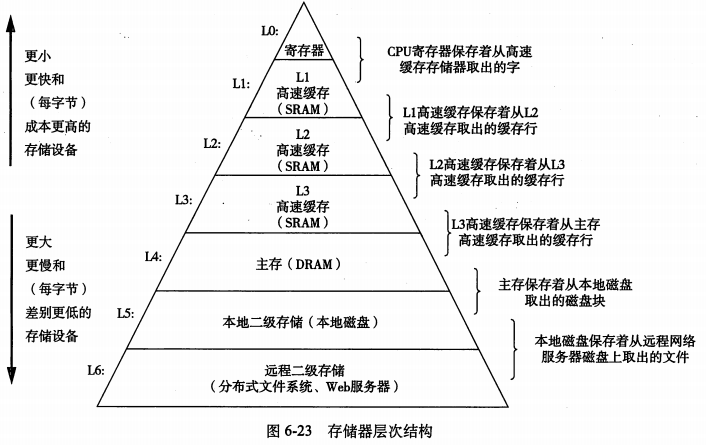

存储器系统是一个具有不同容量、成本和访问时间的存储设备的层次机构。CPU寄存器保存着最常用的数据。靠近CPU的小的、快速的高速缓存存储器作为一部分存储在相对慢速的主存储器中数据和指令的缓冲区域。主存缓存存储在容量较大的、慢速磁盘上的数据，而这些磁盘常常又作为存储在通过网络连接的其他机器的磁盘或磁带上的数据的缓冲区域。
存储器层次机构是可行的，这是因为与下一个更低层次的存储设别相比来说，一个编写良好的程序更倾向于更频繁的访问某一个层次上的存储设备。所以，下一层的存储设备可以更慢速一点，也因此可以更大，每个比特更便宜。整体效果是一个大的存储器池，其成本与层次结构底层最便宜的存储设别相当，但是却以接近于层次结构顶部存储设备的高速率向程序提供数据。

## 存储技术
#### 静态 RAM
SRAM：存储器单元具有双稳态特性，只要有电就会永远保持它的值，干扰消除时，电路就会恢复到稳定值
#### 动态DRAM
DRAM每一位的存储是对一个电容的充电，当电容的电压被扰乱之后，就永远不会恢复

DRAM存储不稳定的应对机制：
- 存储器系统必须周期性地通过读出，或者重写来刷新存储器的每一位
- 使用纠错码

#### SRAM和DRAM的区别
1. 只要有电，SRAM就会保持不变，而DRAM需要不断刷新
2. SRAM的存取比DRAM快
3. SRAM对光和电噪声等干扰不敏感
4. SRAM比DRAM需要使用更多的晶体管，所以更昂贵

DRAM组织成二维阵列降低芯片上地址引脚的数量，但增加了访问时间，DRAM芯片包装在存储器模块中插入到主板的扩展槽上

存储器模块分类：
1. 168个引脚的双列直插存储器模块，以64位为块传送数据
2. 72个引脚的单列直插存储器模块，以32位为块传送数据
#### 访问主存
- 读事务：从主存传送数据到CPU
- 写事务：从CPU传送数据到主存
- 总线：一组并行的导线，能携带地址、数据和控制信号（两个以上的设备也能共享同一根总线）
#### 磁盘存储
1. 磁盘容量
    - 记录密度：磁道一英寸的段中可以放入的位数
    - 磁道密度：从盘片中心出发半径上一英寸的段内可以有的磁道数
    - 面密度：记录密度与磁道密度的乘积
    - 记录区：柱面的集合被分割成不相交的子集合（多区记录技术）
#### 固态硬盘
一个SSD包由一个或多个闪存芯片和闪存翻译层组成
随机读和写的性能差别是由底层闪存基本属性决定的

读写很慢的原因：
- 擦除块需要相对较长的时间
- 写操作试图修改一个包含已经有数据的页p，那么这个二块中的所有带有用数据的页都必须被拷贝到一个新（擦除过的）块，然后才能进行对页p的写

优点:随机访问时间比旋转磁盘块，能耗更低，更结实。
缺点：闪存翻译层中的平均磨损逻辑试图通过将擦除平均分布在所有的块上来最大化每个块的寿命

## 存储器层次结构

- 高速缓存：是一个小而快速地存储设备，它作为存储在更大、也更慢的设备中的数据对象的缓冲区域cash
- 缓存：使用高速缓存的过程cashing
- 块：第k+1层的存储器被划分成连续的对象片，每个块有一个唯一的地址或名字，使之区别于其他的块
- 传送单元：数据总是以块大小为传送单元
#### 缓存命中
当程序需要第k+1层的某个数据对象d时，它首先在当前存储在第k层的一个块中查找d，如果d刚好缓存在第k层中，那么就是我们说的缓存命中。

#### 缓存不命中
若第K层中没有缓存数据对象D，那么就是我们所说的缓存不命中
